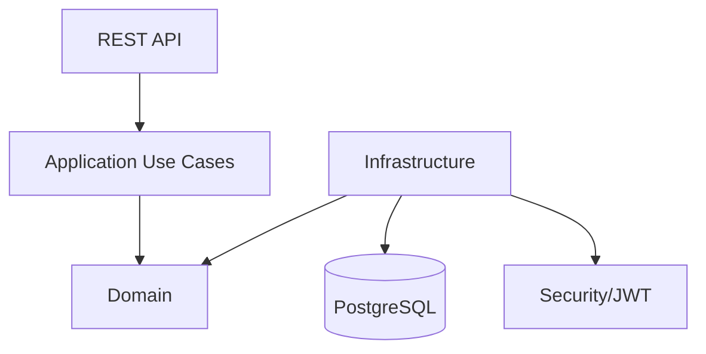
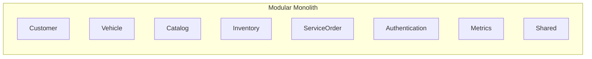

# Modular Monolith

```mermaid
flowchart TB
    API[REST API] --> UseCases[Application Use Cases]
    UseCases --> Domain[Domain]
    Infrastructure[Infrastructure] --> Domain
    Infrastructure --> PostgreSQL[(PostgreSQL)]
    Infrastructure --> Security[Security/JWT]
```

```mermaid
flowchart LR
    subgraph M[Modular Monolith]
      Customer
      Vehicle
      Catalog
      Inventory
      ServiceOrder
      Authentication
      Metrics
      Shared
    end
```
