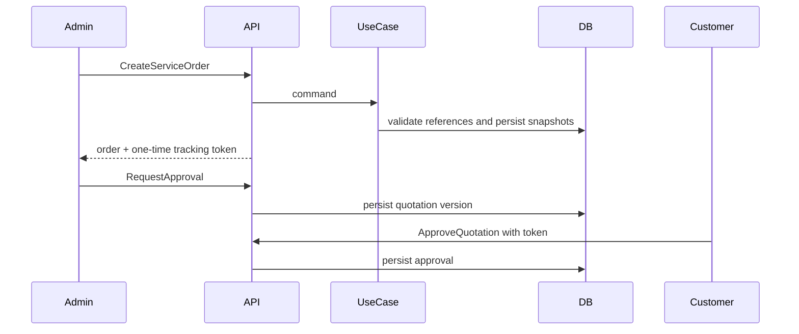
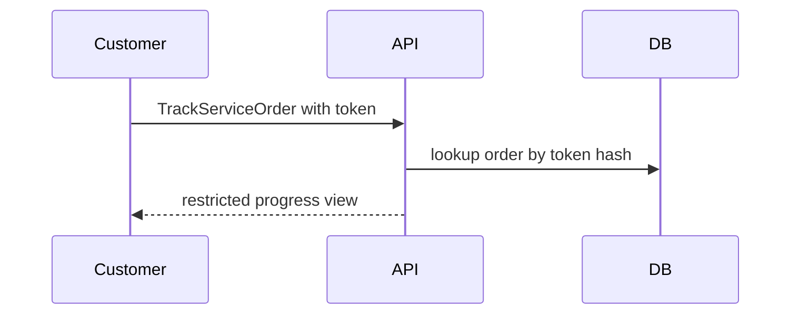

# Sequence Diagrams

## ServiceOrder Creation and Approval

```mermaid
sequenceDiagram
    participant Admin
    participant API
    participant UseCase
    participant DB
    participant Customer
    Admin->>API: CreateServiceOrder
    API->>UseCase: command
    UseCase->>DB: validate references and persist snapshots
    API-->>Admin: order + one-time tracking token
    Admin->>API: RequestApproval
    API->>DB: persist quotation version
    Customer->>API: ApproveQuotation with token
    API->>DB: persist approval
```

## Tracking

```mermaid
sequenceDiagram
    participant Customer
    participant API
    participant DB
    Customer->>API: TrackServiceOrder with token
    API->>DB: lookup order by token hash
    API-->>Customer: restricted progress view
```
