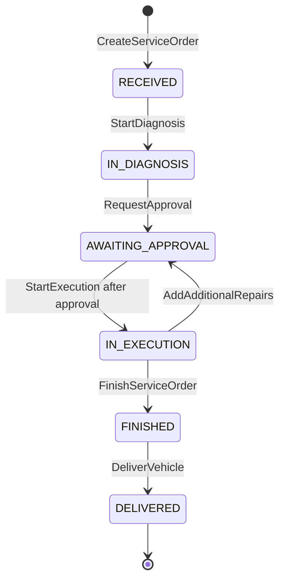

# ServiceOrder Lifecycle

```mermaid
stateDiagram-v2
    [*] --> RECEIVED: CreateServiceOrder
    RECEIVED --> IN_DIAGNOSIS: StartDiagnosis
    IN_DIAGNOSIS --> AWAITING_APPROVAL: RequestApproval
    AWAITING_APPROVAL --> IN_EXECUTION: StartExecution after approval
    IN_EXECUTION --> AWAITING_APPROVAL: AddAdditionalRepairs
    IN_EXECUTION --> FINISHED: FinishServiceOrder
    FINISHED --> DELIVERED: DeliverVehicle
    DELIVERED --> [*]
```

Invalid command/state combinations raise `INVALID_SERVICE_ORDER_TRANSITION`. Starting execution without current approval raises `QUOTATION_APPROVAL_REQUIRED`.
