# Domain Model

```mermaid
classDiagram
    Customer "1" --> "*" Vehicle
    Customer "1" --> "*" ServiceOrder
    Vehicle "1" --> "*" ServiceOrder
    ServiceOrder "1" --> "*" ServiceOrderItem
    ServiceOrder "1" --> "*" Quotation
    ServiceOrder "1" --> "*" Approval
    ServiceOrder "1" --> "*" StatusHistoryEntry
    Quotation "1" --> "*" QuotationLine
    ServiceOrderItem --> CatalogService : SERVICE snapshot
    ServiceOrderItem --> InventoryItem : PART/SUPPLY snapshot
    InventoryItem "1" --> "*" InventoryMovement
```

Aggregate boundaries are Customer, Vehicle, CatalogService, InventoryItem, ServiceOrder, and Administrator. ServiceOrder stores snapshots so historical orders are not recalculated from current catalog or inventory prices.
