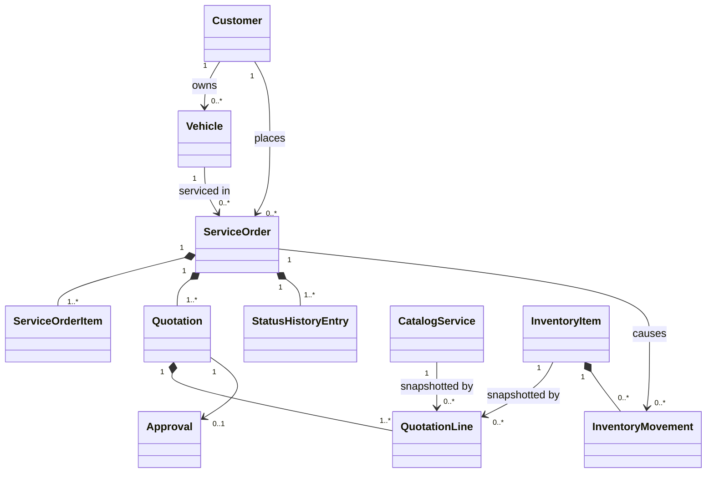

# Data Model: Automotive Repair Shop MVP

## Modeling Conventions

- Aggregate identifiers are UUID-backed value types generated by the application.
- All timestamps are UTC instants assigned through an application clock.
- Money is BRL with two decimal places, `HALF_EVEN` rounding, and exact decimal persistence.
- CPF, CNPJ, and license plates are normalized before validation, comparison, and persistence.
- `createdAt`, `updatedAt`, and optimistic `version` fields exist on mutable aggregate roots.
- API DTOs, domain models, and JPA entities are separate representations with explicit mappings.
- Historical snapshots are intentionally denormalized inside service-order persistence and never resolved
  from current master data when reading an old quotation.

## Shared Value Objects

### Money

| Field | Type | Rules |
|---|---|---|
| amount | BigDecimal | Scale 2; non-negative unless a future explicit adjustment type permits otherwise |
| currency | Currency code | Fixed to `BRL` for Phase 1 |

Operations include exact addition and multiplication by a positive integer quantity. Float and Double are
never accepted. Persistence uses `numeric(19,2)`.

### Document

Sealed variants `Cpf` and `Cnpj` store digits only. CPF must contain 11 digits and pass both check digits;
CNPJ must contain 14 digits and pass both check digits. Repeated-digit values are invalid. The normalized
value is unique across all customers, regardless of punctuation in input.

### LicensePlate

Stores uppercase alphanumeric characters only. Accepts Brazilian legacy `AAA9999` and Mercosur `AAA9A99`
formats. The normalized value is globally unique for active and historical vehicles.

### Typed Identifiers

`CustomerId`, `VehicleId`, `CatalogServiceId`, `InventoryItemId`, `ServiceOrderId`, `QuotationId`,
`ApprovalId`, `StatusHistoryId`, `InventoryMovementId`, and `AdministratorId` wrap UUID and cannot be mixed.

## Aggregate: Customer

**Root**: `Customer`

| Field | Type | Rules |
|---|---|---|
| id | CustomerId | Required, immutable |
| document | Document | Required, valid, immutable after creation, globally unique |
| name | String | Required, trimmed, 2..150 characters |
| email | String? | Optional, valid format when present, max 254 |
| phone | String? | Optional, normalized nonblank value, max 30 |
| active | Boolean | Defaults true; false prevents new vehicles/orders |
| createdAt | Instant | Required, immutable |
| updatedAt | Instant | Required |
| version | Long | Optimistic concurrency |

**Invariants**:

- Exactly one valid CPF or CNPJ identifies the customer.
- Deactivation is used when historical service orders reference the customer.
- Inactive customers remain readable but cannot be selected for new work.

**Repository boundary**: Save, find by ID, find by normalized document, uniqueness check, paged list, and
reference-aware deactivate/delete.

## Aggregate: Vehicle

**Root**: `Vehicle`

| Field | Type | Rules |
|---|---|---|
| id | VehicleId | Required, immutable |
| customerId | CustomerId | Required; must identify an active Customer when created/reassigned |
| licensePlate | LicensePlate | Required, globally unique |
| brand | String | Required, trimmed, max 80 |
| model | String | Required, trimmed, max 100 |
| year | Int | 1886 through current year + 1 |
| active | Boolean | Defaults true |
| createdAt / updatedAt | Instant | Required |
| version | Long | Optimistic concurrency |

**Invariants**:

- A vehicle has exactly one owner in Phase 1.
- An order may select the vehicle only when its `customerId` matches the order customer.
- A referenced vehicle is deactivated rather than physically deleted.

**Repository boundary**: Save, find by ID, find by normalized plate, uniqueness check, paged list, paged
list by customer, and reference-aware deactivate/delete.

## Aggregate: CatalogService

**Root**: `CatalogService` (canonical code term for a service offered by the shop)

| Field | Type | Rules |
|---|---|---|
| id | CatalogServiceId | Required, immutable |
| name | String | Required, trimmed, unique among active services, max 120 |
| description | String | Required, trimmed, max 1000 |
| currentPrice | Money | Required, non-negative |
| active | Boolean | Defaults true |
| createdAt / updatedAt | Instant | Required |
| version | Long | Optimistic concurrency |

Changes affect only future quotation snapshots. Referenced services are deactivated, not destroyed.

## Aggregate: InventoryItem

**Root**: `InventoryItem`

| Field | Type | Rules |
|---|---|---|
| id | InventoryItemId | Required, immutable |
| type | InventoryItemType | Exactly `PART` or `SUPPLY`, immutable |
| name | String | Required, trimmed, unique among active items, max 120 |
| description | String | Required, trimmed, max 1000 |
| unitPrice | Money | Required, non-negative |
| availableQuantity | Long | Required, >= 0 |
| active | Boolean | Defaults true |
| movements | InventoryMovement references | Append-only audit records, loaded separately when needed |
| createdAt / updatedAt | Instant | Required |
| version | Long | Optimistic concurrency plus row lock during multi-item consumption |

### InventoryMovement

| Field | Type | Rules |
|---|---|---|
| id | InventoryMovementId | Required |
| inventoryItemId | InventoryItemId | Required |
| serviceOrderId | ServiceOrderId? | Required for service-order consumption; absent for manual adjustment |
| type | MovementType | `STOCK_ADDED`, `STOCK_REMOVED`, `ORDER_CONSUMED`, `ORDER_RETURNED` |
| quantity | Long | Positive |
| resultingQuantity | Long | >= 0 |
| reason | String | Required for manual adjustment, max 500 |
| occurredAt | Instant | Required |
| actorId | AdministratorId | Required |

**Invariants**:

- Quantity can never become negative.
- An inactive item cannot be selected for new quotations or receive arbitrary order consumption.
- `ORDER_CONSUMED` is unique by service order, quotation line, and cumulative consumed quantity so a retry
  cannot consume twice.
- Multi-item consumption locks items in ascending UUID order to avoid deadlock and applies atomically.

**Repository boundary**: CRUD lookup/list, save with optimistic version, find active items by IDs, lock
items by sorted IDs, append movement, and movement history.

## Aggregate: ServiceOrder

**Root**: `ServiceOrder`

| Field | Type | Rules |
|---|---|---|
| id | ServiceOrderId | Required, immutable |
| customerId | CustomerId | Required, immutable |
| customerSnapshot | CustomerSnapshot | Required, immutable identity/name snapshot |
| vehicleId | VehicleId | Required, immutable |
| vehicleSnapshot | VehicleSnapshot | Required, immutable plate/brand/model/year snapshot |
| status | ServiceOrderStatus | Required; changes only through named domain operations |
| requestedItems | ServiceOrderItem collection | At least one SERVICE item at creation |
| quotations | Quotation collection | Immutable, monotonically versioned |
| approvals | Approval collection | Immutable decisions bound to quotation version |
| statusHistory | StatusHistoryEntry collection | Append-only |
| trackingTokenHash | String | SHA-256 hash, unique; raw token never persisted |
| trackingExpiresAt | Instant? | Optional while open; set according to delivery retention policy |
| trackingRevokedAt | Instant? | Null unless revoked |
| createdAt / updatedAt | Instant | Required |
| version | Long | Optimistic concurrency |

### CustomerSnapshot

Contains normalized document type plus masked document value and customer display name. Full current contact
data is not copied unless required for the order record; it is never present in customer tracking output.

### VehicleSnapshot

Contains normalized license plate, brand, model, and year captured at order creation.

### ServiceOrderItem

| Field | Type | Rules |
|---|---|---|
| id | UUID | Required, immutable |
| sourceType | ItemSourceType | `SERVICE`, `PART`, or `SUPPLY` |
| sourceId | Typed source UUID | Required, immutable |
| descriptionSnapshot | String | Required, immutable per quotation version |
| quantity | Long | Positive |
| unitPriceSnapshot | Money | Non-negative |
| consumedQuantity | Long | 0..quantity; only PART/SUPPLY consume inventory |
| additionalRepair | Boolean | True when added after initial quotation approval |

Items define current proposed scope. Each generated quotation copies them into immutable quotation lines.

### Quotation

| Field | Type | Rules |
|---|---|---|
| id | QuotationId | Required |
| versionNumber | Int | Starts at 1 and increases by exactly 1 per order; unique within order |
| lines | QuotationLine collection | At least one SERVICE line |
| serviceSubtotal | Money | Exact sum of SERVICE lines |
| inventorySubtotal | Money | Exact sum of PART and SUPPLY lines |
| total | Money | serviceSubtotal + inventorySubtotal |
| state | QuotationState | `DRAFT`, `AWAITING_APPROVAL`, `APPROVED`, `REJECTED`, `SUPERSEDED` |
| createdAt | Instant | Required |
| requestedAt | Instant? | Set when approval requested |

Quotation lines capture source ID/type, description, quantity, unit price, and line total. Once generated,
line contents and totals never change. Generating a replacement marks the prior current version
`SUPERSEDED` but retains it.

### Approval

| Field | Type | Rules |
|---|---|---|
| id | ApprovalId | Required |
| quotationId | QuotationId | Required; exactly one decision per quotation version |
| decision | ApprovalDecision | `APPROVED` or `REJECTED` |
| decidedAt | Instant | Required |
| channel | ApprovalChannel | `CUSTOMER_ACCESS_TOKEN` for Phase 1 |

An approval authorizes only its referenced quotation and cannot be edited or reused.

### StatusHistoryEntry

| Field | Type | Rules |
|---|---|---|
| id | StatusHistoryId | Required |
| fromStatus | ServiceOrderStatus? | Null only for initial creation |
| toStatus | ServiceOrderStatus | Required |
| occurredAt | Instant | Required; nondecreasing within the order |
| actorType | ActorType | `ADMINISTRATOR` or `CUSTOMER` |
| actorReference | String? | Administrator ID when applicable; no token value |
| reason | String? | Required for rejection or additional-repair approval wait where useful |

### ServiceOrder State Machine

| Current state | Command | Preconditions | Next state | Side effects |
|---|---|---|---|---|
| none | CreateServiceOrder | Valid active customer; owned active vehicle; >=1 active service | RECEIVED | Snapshot parties/items; issue tracking token; history event |
| RECEIVED | StartDiagnosis | None beyond current state | IN_DIAGNOSIS | Append history |
| IN_DIAGNOSIS | GenerateQuotation / RequestApproval | Valid active item references and exact totals | AWAITING_APPROVAL | Add immutable quotation; mark requested; append history |
| AWAITING_APPROVAL | ApproveQuotation | Current pending version and valid customer token | AWAITING_APPROVAL | Add immutable approval; quotation APPROVED; no status change |
| AWAITING_APPROVAL | RejectQuotation | Current pending version and valid customer token | AWAITING_APPROVAL | Add rejection; quotation REJECTED; no execution allowed |
| AWAITING_APPROVAL | StartExecution | Current quotation APPROVED; sufficient stock | IN_EXECUTION | Consume outstanding inventory atomically; append history |
| IN_EXECUTION | AddAdditionalRepair / RequestApproval | Added scope changes current approved quotation | AWAITING_APPROVAL | Add new quotation version; prior superseded; append history |
| IN_EXECUTION | FinishServiceOrder | All required approved work executable/complete | FINISHED | Close final active execution interval; append history |
| FINISHED | DeliverVehicle | None beyond current state | DELIVERED | Append history; set tracking expiry policy |

Every command not listed for the current state fails with `INVALID_SERVICE_ORDER_TRANSITION`. Starting or
resuming execution without current approval fails with `QUOTATION_APPROVAL_REQUIRED`. Insufficient stock
fails with `INSUFFICIENT_STOCK` and rolls back the complete action. Finished and Delivered orders reject
scope, quotation, approval, inventory, and snapshot modification.

**Repository boundary**: Save, find aggregate by ID, find-and-lock by ID, paged summary query by status,
detail query, find by tracking hash with expiry/revocation check, and lifecycle history queries for metrics.

## Aggregate: Administrator

| Field | Type | Rules |
|---|---|---|
| id | AdministratorId | Required |
| username | String | Normalized, required, unique |
| passwordHash | String | BCrypt only; never returned or logged |
| active | Boolean | Required |
| roles | Set | `ADMIN` for Phase 1 |
| createdAt / updatedAt | Instant | Required |

Authentication is a supporting technical capability and has no dependency from core business domains.

## Metrics Read Model

`ExecutionTimeSummary` is not an aggregate and is not persisted. For orders entering FINISHED in the
requested inclusive-start/exclusive-end interval:

1. Pair each `IN_EXECUTION` entry with the next exit to `AWAITING_APPROVAL` or `FINISHED`.
2. Sum paired intervals per order.
3. Average per-order active durations across eligible orders.
4. Return period start/end, eligible order count, and average duration; average is absent when count is zero.

## Relational Schema and Index Plan

| Table | Purpose and key constraints/indexes |
|---|---|
| `customers` | UUID PK; `document_type`; unique normalized `document_value`; active; version |
| `vehicles` | UUID PK; FK customer; unique normalized plate; index customer; active; version |
| `catalog_services` | UUID PK; current price check >=0; active; name index; version |
| `inventory_items` | UUID PK; type check; price/quantity checks >=0; active; name index; version |
| `inventory_movements` | UUID PK; FK item; nullable FK order; quantity >0; indexes item/time and order |
| `administrators` | UUID PK; unique username; BCrypt hash; active |
| `service_orders` | UUID PK; FK customer/vehicle; status check; unique tracking hash; indexes status, customer, created time; version |
| `service_order_items` | UUID PK; FK order; source type/id; quantity/consumed checks; index order |
| `quotations` | UUID PK; FK order; unique(order, version number); subtotal/total checks; state; index order |
| `quotation_lines` | UUID PK; FK quotation; quantity and monetary checks; index quotation |
| `approvals` | UUID PK; unique FK quotation; decision/time; index quotation |
| `service_order_status_history` | UUID PK; FK order; status checks; indexes order/time and target status/time |

Foreign keys use restrictive deletion for historical business records. Physical deletion is allowed only
for unreferenced master records through reference-aware application operations; normal referenced-record
removal sets `active=false`.

## Cross-Aggregate Relationship Summary

Arrows to quotation lines represent source references plus snapshots, not aggregate ownership or live
price lookup.
